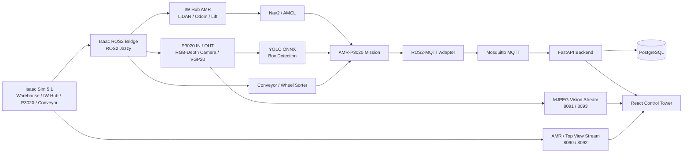
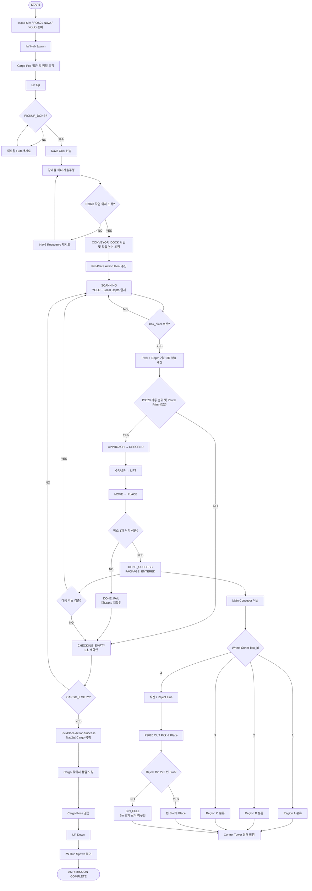

# AMR–협동로봇 연계 택배 분류 자동화 및 실시간 관제 시스템

Isaac Sim 5.1 + ROS 2 Jazzy 기반의 물류 자동화 통합 프로젝트입니다.

IW Hub AMR, Doosan P3020, VGP20 gripper, RGB/Depth camera, Conveyor, Wheel Sorter, YOLO ONNX vision, Nav2, MQTT, FastAPI, PostgreSQL, React Control Tower를 하나의 시나리오로 연결합니다.

> 본 저장소의 `main`은 Isaac Sim 시뮬레이션 기반 제출/시연 버전입니다. 아래 설치 및 실행 순서는 `ROS_DOMAIN_ID=110`, `RMW_IMPLEMENTATION=rmw_fastrtps_cpp` 기준입니다.

---

## 목차

0. [ZIP 압축 해제 후 처음 실행](#0-zip-압축-해제-후-처음-실행)
1. [시스템 설계](#1-시스템-설계)
2. [전체 Flow Chart](#2-전체-flow-chart)
3. [운영체제 및 개발 환경](#3-운영체제-및-개발-환경)
4. [사용 장비 및 시뮬레이션 구성](#4-사용-장비-및-시뮬레이션-구성)
5. [주요 시뮬레이션 Asset / 실행 파일](#5-주요-시뮬레이션-asset--실행-파일)
6. [로봇 및 장비 제어 Python 코드](#6-로봇-및-장비-제어-python-코드)
7. [ROS2 패키지](#7-ros2-패키지)
8. [Dependencies / 설치 방법](#8-dependencies--설치-방법)
9. [실행 순서](#9-실행-순서)
10. [제출용 ZIP 생성 전 정리](#10-제출용-zip-생성-전-정리)

---

# 0. ZIP 압축 해제 후 처음 실행

이 절차는 **Git clone이 아니라 제출용 ZIP을 전달받은 사용자**를 기준으로 합니다.

압축을 푼 뒤 `README.md`, `compose.yaml`, `isaac_sim/`, `ros2_ws/`, `scripts/`가 보이는 `cobot3-ws-c2` 폴더가 **프로젝트 root**입니다.

예시:

```text
Downloads/
└── cobot3-ws-c2_submission/
    └── cobot3-ws-c2/        ← 프로젝트 root
        ├── README.md
        ├── compose.yaml
        ├── isaac_sim/
        ├── ros2_ws/
        └── scripts/
```

> 아래의 모든 명령은 특별히 다른 경로가 표시되지 않는 한 **프로젝트 root에서 시작**합니다. 개인 PC의 `~/collaboration/...` 같은 고정 경로는 필요하지 않습니다.

## 0.1 프로젝트 root로 이동

터미널에서 실제 압축 해제 위치의 `cobot3-ws-c2` 폴더로 이동합니다.

예시:

```bash
cd ~/cobot3-ws-c2_submission/cobot3-ws-c2
pwd
ls
```

다음 항목이 보이면 정상입니다.

```text
README.md
compose.yaml
isaac_sim
ros2_ws
scripts
frontend
backend
```

## 0.2 실행용 환경 파일 생성

제출 ZIP에는 개인 환경값이 들어간 `.env`를 포함하지 않습니다. example 파일을 복사해 실행용 파일을 만듭니다.

```bash
cp .env.example .env
cp frontend/.env.example frontend/.env
```

기본 Docker DB 설정 확인:

```bash
cat .env
```

기본값:

```text
POSTGRES_DB=control_tower
POSTGRES_USER=controltower
POSTGRES_PASSWORD=controltower-dev
```

## 0.3 Host Python 환경 생성

ROS2/MQTT Adapter용 환경:

```bash
bash scripts/setup_adapter_env.sh
```

Vision/YOLO용 환경:

```bash
bash scripts/setup_vision_env.sh
```

> ZIP 압축/해제 과정에서 shell script의 실행 권한이 보존되지 않을 수 있으므로 초기 setup은 `./scripts/...` 대신 `bash scripts/...` 형태를 권장합니다.

확인:

```bash
.venv/bin/python3 -c "import paho.mqtt.client as mqtt; print(mqtt.CallbackAPIVersion.VERSION2)"
.venv/bin/python3 -c "import onnxruntime; print(onnxruntime.__version__)"
```

## 0.4 Frontend dependency 설치

프로젝트 root에서:

```bash
cd frontend
npm ci
cd ..
```

## 0.5 ROS2 workspace 최초 build

제출 ZIP에는 `build`, `install`, `log`를 넣지 않으므로 **최초 실행 전에 반드시 새로 build**해야 합니다.

프로젝트 root에서:

```bash
source /opt/ros/jazzy/setup.bash

cd ros2_ws
colcon build --symlink-install
source install/setup.bash
cd ..
```

패키지 확인:

```bash
source /opt/ros/jazzy/setup.bash
source ros2_ws/install/setup.bash

ros2 pkg list | grep arm_controller
ros2 pkg list | grep amr_controller
```

`arm_controller`, `amr_controller`가 출력되면 자체 ROS2 workspace build가 정상입니다.

## 0.6 외부 NVIDIA ROS workspace 확인

Nav2 실행은 NVIDIA Isaac Sim ROS Jazzy workspace의 `iw_hub_navigation` 패키지를 사용합니다.

기본 예시 경로:

```text
~/IsaacSim-ros_workspaces/jazzy_ws
```

다음으로 확인할 수 있습니다.

```bash
source /opt/ros/jazzy/setup.bash

if [ -f "$HOME/IsaacSim-ros_workspaces/jazzy_ws/install/setup.bash" ]; then
  source "$HOME/IsaacSim-ros_workspaces/jazzy_ws/install/setup.bash"
fi

ros2 pkg list | grep iw_hub_navigation
```

`iw_hub_navigation`이 없다면 해당 NVIDIA ROS workspace를 먼저 준비해야 합니다.

## 0.7 Docker 서비스 최초 실행

```bash
sudo docker compose down -v --remove-orphans
sudo docker compose up -d --build
sudo docker compose ps
```

정상 예:

```text
control_tower_postgres     ... healthy
control_tower_mosquitto    ... Up
control_tower_backend      ... Up
```

여기까지 성공하면 최초 환경 구성이 끝난 것입니다. 이후에는 [9. 실행 순서](#9-실행-순서)에 따라 Isaac Sim → Nav2 → Pose Sync → Adapter → P3020 → Vision → Frontend → Mission 순서로 실행합니다.

---

# 1. 시스템 설계

## System Architecture



### 데이터 흐름

- **로봇/공정 상태**: Isaac Sim → ROS2 → MQTT Adapter → Mosquitto → FastAPI → PostgreSQL / React
- **AMR 자율주행**: Isaac Sim LiDAR/Odom → ROS2 → Nav2/AMCL → AMR velocity command
- **P3020 작업**: Camera → YOLO ONNX → box pixel → P3020 Pick & Place → Action result
- **실시간 영상**: ROS Image → MJPEG stream → React Control Tower

---

# 2. 전체 Flow Chart

> FigJam 원본: [P3020 Pick & Place Mission Flow](https://www.figma.com/board/1833sIkwqEzvNOsQS1MEag/P3020-Pick---Place-Mission-Flow?node-id=0-1)
>
> 제출본에서도 전체 흐름과 YES/NO 분기를 바로 확인할 수 있도록 FigJam의 Mission Flow를 Mermaid로 재구성했습니다.



### 핵심 Mission 흐름

`IW Hub Spawn → Cargo Pod 접근 → Lift Up → PICKUP_DONE → Nav2 자율주행 → P3020 작업 위치 → YOLO 박스 검출 → box_pixel → Pixel + Depth → 3D 좌표 → P3020 반복 Pick & Place → CARGO_EMPTY → Cargo 원위치 복귀/정밀 도킹 → Lift Down → IW Hub Spawn 복귀 → COMPLETE`

---

# 3. 운영체제 및 개발 환경

| 항목 | 버전 / 설정 |
|---|---|
| OS | Ubuntu 24.04 |
| NVIDIA Isaac Sim | 5.1.0 |
| ROS 2 | Jazzy |
| Python (Host / ROS2) | 3.12 |
| Python (Isaac Sim Embedded) | 3.11 |
| ROS Domain | `ROS_DOMAIN_ID=110` |
| RMW | `rmw_fastrtps_cpp` |
| Navigation | Nav2 / AMCL |
| Simulation | USD / PhysX / OmniGraph |
| Vision | OpenCV / ONNX Runtime / YOLO model |
| Backend | FastAPI |
| Message Broker | Eclipse Mosquitto MQTT |
| Database | PostgreSQL 16 |
| Frontend | React 18 / Vite 7 |
| Container | Docker + Docker Compose plugin |
| Node.js | 20.19+ 또는 22.12+ (24 LTS 권장) |
| npm | 9+ |

Isaac Sim 실행 PC는 NVIDIA RTX GPU가 필요합니다.

프로젝트 기본 ROS 통신 설정:

```bash
export ROS_DOMAIN_ID=110
export RMW_IMPLEMENTATION=rmw_fastrtps_cpp
```

> 모든 프로젝트 실행 스크립트의 기본 ROS Domain은 `110`으로 통일되어 있습니다.

---

# 4. 사용 장비 및 시뮬레이션 구성

본 제출본은 **Isaac Sim 기반 시뮬레이션**으로 구성됩니다.

| 장비 / 구성 | 역할 |
|---|---|
| NVIDIA IW Hub AMR | Cargo Pod 운반 및 Nav2 자율주행 |
| Front / Back 2D LiDAR | AMR 장애물 인식 및 Nav2 costmap 입력 |
| Doosan P3020 | Parcel Pick & Place |
| VGP20 Gripper | 박스 흡착 / 해제 |
| RSD455 RGB/Depth Camera | P3020 박스 위치 인식 |
| Main Conveyor | Parcel 이송 |
| Wheel Sorter | Parcel 지역 분류 |
| Cargo Pod / Parcel | 물류 적재 및 분류 대상 |
| Control Tower PC | 관제 UI / Backend / DB / MQTT |

---

# 5. 주요 시뮬레이션 Asset / 실행 파일

## 메인 시뮬레이션 USD

최종 Warehouse 메인 USD:

```text
isaac_sim/usd/Final_Real_Map/Parcel_Sorting_Map.usd
```

`isaac_sim/main_mission.py`가 위 USD를 메인 Warehouse stage로 사용합니다.

Nav2 map:

```text
isaac_sim/usd/Final_Real_Map/navigation/maps/Final.yaml
```

## 메인 Isaac 실행 Python

```text
isaac_sim/main_mission.py
isaac_sim/main_mission_live_view.py
```

실행 스크립트:

```text
scripts/run_isaac_mission.sh
```

`run_isaac_mission.sh`는 Control Tower용 live view wrapper인 `main_mission_live_view.py`를 실행하고, 내부적으로 기존 mission logic을 사용합니다.

## P3020 Asset / URDF

```text
isaac_sim/assets/p3020/p3020.urdf
isaac_sim/assets/p3020/p3020_description.yaml
isaac_sim/assets/p3020/P3020_mount_vgp20/
isaac_sim/assets/p3020/P3020_mount_vgp20_rsd455_1/
isaac_sim/assets/p3020/meshes/
isaac_sim/assets/vgp20/
```

그 외 Warehouse / conveyor / wheel sorter / parcel 관련 asset은 다음 위치에 있습니다.

```text
isaac_sim/assets/
isaac_sim/usd/
```

> 제출 ZIP에는 `usd`, `usda`, `urdf`, mesh 및 이들이 참조하는 asset 파일을 함께 포함해야 합니다.

---

# 6. 로봇 및 장비 제어 Python 코드

과제의 “서보모터/로봇 제어 Python 코드”에 해당하는 핵심 파일입니다.

## P3020 IN Pick & Place / Joint / Gripper 제어

```text
isaac_sim/robots/p3020/p3020_mission_agent.py
```

- P3020 관절 동작
- VGP20 grasp / release
- RGB/Depth 기반 박스 접근
- Pick & Place 상태 관리

## P3020 OUT 제어

```text
isaac_sim/robots/p3020/p3020_out_mission_agent.py
```

## ROS2 P3020 Action Server

```text
ros2_ws/src/arm_controller/arm_controller/pick_place_action_server.py
```

Action:

```text
/p3020/pick_place
```

## IW Hub AMR Mission 제어

```text
isaac_sim/robots/iw_hub/iw_hub_mission_agent.py
scripts/run_amr_p3020_mission.sh
```

## Conveyor / Wheel Sorter 제어

```text
isaac_sim/equipment/conveyor/conveyor_controller.py
isaac_sim/equipment/wheel_sorter/wheel_sorter_controller.py
```

## Vision

```text
isaac_sim/robots/p3020/vision/box_detector_node.py
isaac_sim/robots/p3020/vision/object_detector.py
models/parcel_box_yolo_model/best.onnx
```

---

# 7. ROS2 패키지

프로젝트 자체 ROS2 workspace:

```text
ros2_ws/src/
├── amr_controller
├── arm_controller
├── logistics_bringup
├── logistics_interfaces
├── mission_manager
├── sorter_controller
└── vision_node
```

외부 NVIDIA Isaac Sim ROS Jazzy workspace에서 사용하는 패키지:

```text
iw_hub_navigation
```

기본 외부 workspace 경로 예시:

```text
~/IsaacSim-ros_workspaces/jazzy_ws
```

다른 경로를 사용하면 해당 workspace의 `install/setup.bash`를 source한 뒤 실행합니다.

---

# 8. Dependencies / 설치 방법

## 8.1 사전에 설치되어 있어야 하는 프로그램

- Ubuntu 24.04
- NVIDIA Isaac Sim 5.1.0
- ROS 2 Jazzy (`/opt/ros/jazzy`)
- Docker Engine
- Docker Compose plugin (`docker compose`)
- NVIDIA Isaac Sim ROS Jazzy workspace + `iw_hub_navigation`
- Git
- Python 3.12 (Host / ROS2; Isaac Sim embedded Python 3.11은 Isaac Sim에 포함)
- Node.js 20.19+ 또는 22.12+ (24 LTS 권장)
- npm 9+

Ubuntu helper package:

```bash
sudo apt update
sudo apt install -y \
  python3.12-venv \
  python3-opencv \
  python3-rosdep \
  python3-colcon-common-extensions
```

Node.js/npm은 별도로 설치합니다. Ubuntu 기본 `nodejs` 패키지는 필요한 버전보다 낮을 수 있으므로 `node -v`로 확인하세요. nvm이 설치되어 있다면 `nvm install 24 && nvm use 24`로 Node.js와 npm을 함께 준비할 수 있습니다.

## 8.2 프로젝트 준비

### Git 사용 시

```bash
git clone https://github.com/rokey-c2/cobot3-ws-c2.git
cd cobot3-ws-c2
git switch main
```

### 제출 ZIP 사용 시

ZIP을 압축 해제한 뒤 `cobot3-ws-c2` 프로젝트 root로 이동합니다. Git은 필요하지 않습니다.

## 8.3 환경 파일

프로젝트 root에서:

```bash
cp .env.example .env
cp frontend/.env.example frontend/.env
```

## 8.4 Python / Frontend dependency 설치

ROS2/MQTT Adapter:

```bash
bash scripts/setup_adapter_env.sh
```

Vision/YOLO:

```bash
bash scripts/setup_vision_env.sh
```

Frontend:

```bash
cd frontend
npm ci
cd ..
```

Host Python dependency entry point:

```text
requirements.txt
```

세부 파일:

```text
requirements/vision.txt
requirements/ros2_adapter.txt
backend/requirements.txt
frontend/package.json
frontend/package-lock.json
```

현재 중요한 호환성 조건:

```text
paho-mqtt >= 2.0, < 3
onnxruntime >= 1.18, < 2
```

`pose_sync_manager.py`는 `paho-mqtt 2.x`의 `CallbackAPIVersion.VERSION2`를 사용하며, ROS2/MQTT Adapter도 `paho-mqtt 2.x` 환경에서 실행됩니다.

## 8.5 ROS2 workspace build

프로젝트 root에서:

```bash
source /opt/ros/jazzy/setup.bash
cd ros2_ws
colcon build --symlink-install
source install/setup.bash
cd ..
```

> 제출 ZIP에는 `ros2_ws/build`, `ros2_ws/install`, `ros2_ws/log`가 없기 때문에 압축 해제 후 최초 1회 build가 필수입니다.

환경 검사:

```bash
bash scripts/check_environment.sh
```

---

# 9. 실행 순서

**중요:** 아래 각 Terminal은 모두 **압축을 푼 `cobot3-ws-c2` 프로젝트 root에서 시작**합니다.

프로젝트 root 예시 확인:

```bash
pwd
ls README.md compose.yaml scripts ros2_ws isaac_sim
```

사용자마다 압축을 푼 위치가 다르므로 `~/collaboration/...` 같은 고정 절대경로는 사용하지 않습니다.

## Terminal 1 — Docker DB / MQTT / Backend

프로젝트 root에서, 처음 실행하거나 DB를 초기화할 때:

```bash
sudo docker compose down -v --remove-orphans
sudo docker compose up -d --build
sudo docker compose ps
```

`-v`는 PostgreSQL / MQTT volume 데이터를 삭제합니다.

DB를 유지할 때는:

```bash
sudo docker compose up -d --build
```

정상 예:

```text
control_tower_postgres     ... healthy
control_tower_mosquitto    ... Up
control_tower_backend      ... Up
```

## Terminal 2 — Isaac Sim

새 터미널을 프로젝트 root에서 열고:

```bash
export ROS_DOMAIN_ID=110
export RMW_IMPLEMENTATION=rmw_fastrtps_cpp
bash scripts/run_isaac_mission.sh
```

Isaac Sim이 완전히 올라오고 다음 sensor publisher가 생성된 뒤 Terminal 3을 실행합니다.

```text
/clock
/front_2d_lidar/scan
/back_2d_lidar/scan
/chassis/odom
```

## Terminal 3 — ROS2 Nav2 / RViz

새 터미널을 프로젝트 root에서 열고:

```bash
source /opt/ros/jazzy/setup.bash
export ROS_DOMAIN_ID=110
export RMW_IMPLEMENTATION=rmw_fastrtps_cpp
bash scripts/run_ros2.sh
```

다음 로그 확인:

```text
[ROS2] Nav2 is ready.
```

## Terminal 4 — Pose Sync

새 터미널을 프로젝트 root에서 열고:

```bash
source /opt/ros/jazzy/setup.bash
export ROS_DOMAIN_ID=110
export RMW_IMPLEMENTATION=rmw_fastrtps_cpp
bash scripts/run_pose_sync.sh
```

## Terminal 5 — Control Tower ROS2 / MQTT Adapter

새 터미널을 프로젝트 root에서 열고:

```bash
source /opt/ros/jazzy/setup.bash
export ROS_DOMAIN_ID=110
export RMW_IMPLEMENTATION=rmw_fastrtps_cpp
bash scripts/run_control_tower_adapters.sh
```

## Terminal 6 — P3020 Action Server

새 터미널을 프로젝트 root에서 열고:

```bash
source /opt/ros/jazzy/setup.bash
source ros2_ws/install/setup.bash
export ROS_DOMAIN_ID=110
export RMW_IMPLEMENTATION=rmw_fastrtps_cpp

ros2 run arm_controller pick_place_action_server
```

> `ros2_ws/install/setup.bash`가 없다면 아직 ROS2 workspace를 build하지 않은 것입니다. 먼저 [0.5 ROS2 workspace 최초 build](#05-ros2-workspace-최초-build)를 실행하세요.

## Terminal 7 — Vision / YOLO / MJPEG

새 터미널을 프로젝트 root에서 열고:

```bash
source /opt/ros/jazzy/setup.bash
export ROS_DOMAIN_ID=110
export RMW_IMPLEMENTATION=rmw_fastrtps_cpp
bash scripts/run_vision_streams.sh
```

기본 stream:

| Port | Stream |
|---:|---|
| 8090 | AMR Front Camera |
| 8091 | P3020 IN + YOLO |
| 8092 | Warehouse Top View |
| 8093 | P3020 OUT + YOLO |

IN·OUT은 YOLO 박스 후보를 해당 RGB/depth 프레임으로 검증한 뒤 초록색 테두리,
중앙 조준점과 `TARGET LOCKED 신뢰도%`를 표시합니다. OUT 카메라는 기존대로
소터가 D 목적지 박스를 감지한 뒤 활성화됩니다. 웹 하단은 각 스트림의 `/health`를
조회해 `TARGET LOCKED`, `SCANNING`, `WAITING`을 표시합니다.

웹 서버와 비전 서버가 다른 PC라면 `frontend/.env`의
`VITE_P3020_IN_CAMERA_STREAM_URL`과 `VITE_P3020_OUT_CAMERA_STREAM_URL`을 각각
`http://<비전-PC-IP>:8091/stream.mjpg`, `http://<비전-PC-IP>:8093/stream.mjpg`로
설정하고 웹 서버를 다시 실행하세요.

## Terminal 8 — React Control Tower

새 터미널을 프로젝트 root에서 열고:

```bash
cd frontend
npm run dev
```

`node_modules`가 아직 없다면 먼저:

```bash
npm ci
npm run dev
```

Browser:

```text
http://localhost:5173
```

FastAPI:

```text
http://localhost:8000
```

## Terminal 9 — 실행 전 확인

새 터미널을 프로젝트 root에서 열고:

```bash
source /opt/ros/jazzy/setup.bash
source ros2_ws/install/setup.bash
export ROS_DOMAIN_ID=110
export RMW_IMPLEMENTATION=rmw_fastrtps_cpp

ros2 action list | grep p3020
ros2 action list | grep navigate_to_pose
ros2 topic info /clock
ros2 topic info /chassis/odom
ros2 topic info /rgb
ros2 topic info /box_pixel
ros2 topic info /top_view/rgb
ros2 topic info /arm_b/rgb
ros2 topic info /arm_b/box_pixel
```

정상 Action 예:

```text
/p3020/pick_place
/navigate_to_pose
```

## Terminal 10 — 전체 AMR + P3020 Mission

새 터미널을 프로젝트 root에서 열고:

```bash
source /opt/ros/jazzy/setup.bash
source ros2_ws/install/setup.bash
export ROS_DOMAIN_ID=110
export RMW_IMPLEMENTATION=rmw_fastrtps_cpp

bash scripts/run_amr_p3020_mission.sh \
  --ros-args \
  -p simulate_p3020:=false \
  -p pickup_x:=1.5 \
  -p pickup_y:=-2.0 \
  -p place_x:=-0.5 \
  -p place_y:=0.0
```

실제 P3020 Action 경로를 사용하려면 반드시 다음 값이 필요합니다.

```text
simulate_p3020:=false
```

---

# 10. 제출용 ZIP 생성 전 정리

과제 제출용 ZIP에는 **소스 및 Asset만 포함**하고 생성물/캐시/가상환경은 제외합니다.

## 반드시 포함

```text
README.md
requirements.txt
requirements/
backend/requirements.txt
frontend/package.json
frontend/package-lock.json
isaac_sim/
models/
ros2_ws/src/
scripts/
docs/
compose.yaml
.env.example
frontend/.env.example
```

특히 다음 파일/폴더는 삭제하지 않습니다.

```text
isaac_sim/usd/
isaac_sim/assets/
isaac_sim/assets/p3020/p3020.urdf
models/parcel_box_yolo_model/best.onnx
ros2_ws/src/
```

## 제출 전에 삭제

프로젝트 root에서:

```bash
sudo docker compose down --remove-orphans
rm -rf ros2_ws/build
rm -rf ros2_ws/install
rm -rf ros2_ws/log
rm -rf .venv
rm -rf .runtime
rm -rf frontend/node_modules
rm -rf frontend/dist
rm -rf frontend/.vite

find . -type d -name "__pycache__" -prune -exec rm -rf {} +
find . -type f -name "*.pyc" -delete
```

개인 환경 파일은 제출 ZIP에서 제외하고 example 파일만 포함하는 것을 권장합니다.

```bash
rm -f .env
rm -f frontend/.env
```

## ZIP 생성 예시

프로젝트 root의 상위 폴더에서:

```bash
cd ..
zip -r cobot3-ws-c2_submission.zip cobot3-ws-c2 \
  -x "cobot3-ws-c2/.git/*" \
     "cobot3-ws-c2/.venv/*" \
     "cobot3-ws-c2/.runtime/*" \
     "cobot3-ws-c2/frontend/node_modules/*" \
     "cobot3-ws-c2/frontend/dist/*" \
     "cobot3-ws-c2/frontend/.vite/*" \
     "cobot3-ws-c2/ros2_ws/build/*" \
     "cobot3-ws-c2/ros2_ws/install/*" \
     "cobot3-ws-c2/ros2_ws/log/*" \
     "*/__pycache__/*" \
     "*.pyc" \
     "cobot3-ws-c2/.env" \
     "cobot3-ws-c2/frontend/.env"
```

## ZIP 검증

압축 파일을 임시 폴더에 다시 풀어 확인합니다.

```bash
mkdir -p ~/submission_test
cd ~/submission_test
unzip /path/to/cobot3-ws-c2_submission.zip
cd cobot3-ws-c2
```

필수 파일 확인:

```bash
ls README.md requirements.txt
ls ros2_ws/src
ls isaac_sim/usd/Final_Real_Map
ls isaac_sim/assets/p3020
```

`build`, `install`, `log`가 제출본에 없는지 확인:

```bash
find ros2_ws -maxdepth 1 -type d -print
```

제출본에서는 초기 상태에서 `ros2_ws`와 `ros2_ws/src`만 남아 있는 것이 정상입니다. 실제 실행 시 사용자가 `colcon build`를 하면 `build`, `install`, `log`가 다시 생성됩니다.

---

## 프로젝트 구조

```text
cobot3-ws-c2/
├── backend/              # FastAPI + PostgreSQL + MQTT backend
├── frontend/             # React Control Tower
├── isaac_sim/
│   ├── assets/           # Robot / gripper / parcel assets
│   ├── equipment/        # Conveyor / sorter controller
│   ├── robots/           # IW Hub / P3020 control
│   ├── usd/              # Warehouse USD + navigation map
│   ├── main_mission.py
│   └── main_mission_live_view.py
├── models/               # YOLO ONNX model
├── mqtt/                 # Mosquitto configuration
├── requirements/         # Host Python dependencies
├── ros2_ws/
│   └── src/              # ROS2 source packages
├── scripts/              # Setup / launch / mission scripts
├── docs/                 # Architecture / scenario documents
├── compose.yaml
├── requirements.txt
└── README.md
```

---

## 주요 문서

- `docs/new_pc_setup.md`
- `docs/conveyor_sorter_control.md`
- `docs/scenario/amr_pose_sync_complete.md`
- `docs/scenario/control_tower_live_integration.md`
- `docs/architecture/locate_box_pipeline.md`

---

## 주의 사항

- `isaac_sim/project_config/`를 사용합니다. 일반적인 `config/` 이름은 Isaac Sim/OpenCV 내부 모듈과 충돌할 수 있습니다.
- 제출 ZIP 생성 시 `ros2_ws/build`, `ros2_ws/install`, `ros2_ws/log`를 반드시 제외합니다.
- `.venv`, `node_modules`, `__pycache__`, `.pyc`는 제출하지 않습니다.
- `.env`에는 개인 환경값이 들어갈 수 있으므로 `.env.example`을 제출합니다.
- ZIP 압축 해제 후에는 `.env` 생성, Python/Frontend dependency 설치, `colcon build`를 먼저 수행해야 합니다.
- README의 실행 명령은 특정 사용자의 홈 디렉터리에 의존하지 않으며, 압축을 푼 프로젝트 root를 기준으로 합니다.
