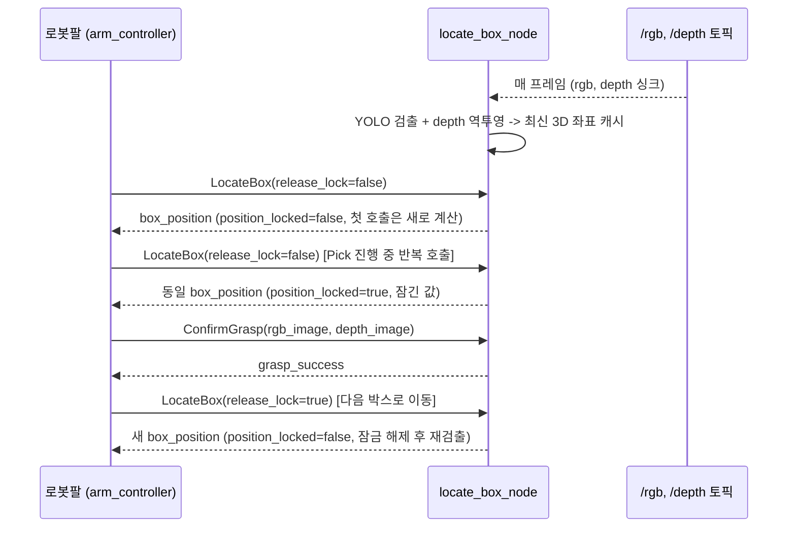

# LocateBox / ConfirmGrasp 파이프라인

영상인식(vision) ↔ 로봇팔(P3020) 간 박스 위치 인식 서비스. 현재까지 구현 + 로컬(WSL) 검증 완료 상태.

## 전체 흐름



## 왜 "잠금(lock)" 상태가 필요한가

Pick 동작 도중 로봇팔이 좌표를 여러 번 물어볼 수 있는데, 그때마다 새로 검출하면
카메라 노이즈나 YOLO 프레임별 편차로 좌표가 조금씩 흔들린다. 그래서 한 번 검출한
좌표를 "잠그고" Pick이 끝날 때까지(`release_lock=true` 호출 전까지) 같은 값을
반환한다.

## 인터페이스

### `LocateBox.srv` (`ros2_ws/src/logistics_interfaces/srv/LocateBox.srv`)

| 필드 | 방향 | 의미 |
|---|---|---|
| `release_lock` | 요청 | `true`=잠금 해제 후 재검출, `false`=기본 호출(잠겨있으면 유지) |
| `box_detected` | 응답 | 박스 검출 여부. `false`면 좌표는 (0,0,0)로 의미 없음 |
| `box_position` | 응답 | 박스 3D 좌표 (카메라 좌표계, meter) |
| `position_locked` | 응답 | `true`=이번 응답이 잠긴(재계산 아닌) 값 |

**서버 로직** (`locate_box_node.py:_handle_locate_box`):
1. `release_lock=true`면 먼저 내부 잠금을 푼다.
2. 잠겨 있으면 → 잠긴 좌표 그대로 반환 (`position_locked=true`).
3. 안 잠겨 있으면 → 최신 검출 결과로 새로 잠그고 반환 (`position_locked=false`).
   검출된 게 없으면 `box_detected=false`.

→ `release_lock=true` 호출도 3번 분기를 타기 때문에, 그 즉시 새로 검출해서
다시 잠그는 효과가 난다 (그래서 다음 `release_lock=false` 반복 호출에서도
값이 안정적으로 유지됨).

### `ConfirmGrasp.srv` (`ros2_ws/src/logistics_interfaces/srv/ConfirmGrasp.srv`)

| 필드 | 방향 | 의미 |
|---|---|---|
| `rgb_image`, `depth_image` | 요청 | 로봇팔이 흡착 시도 직후 보는 현재 프레임 |
| `grasp_success` | 응답 | 흡착 성공 여부 |

**⚠️ 판단 로직은 아직 placeholder**: 지금은 "요청받은 rgb에서 박스가 더 이상
검출되지 않으면 성공"으로 임시 구현해놨다 (`depth_image`는 아직 안 씀).
실제 판단 기준(그리퍼 occupancy, force 센서 연동 여부 등)은 팀과 확정 필요.

## 검출 → 3D 좌표 계산 로직 (`locate_box_node.py`)

1. `/rgb`, `/depth` 토픽을 `message_filters.ApproximateTimeSynchronizer`로 싱크
   (QoS는 `qos_profile_sensor_data` = best_effort — 카메라 토픽 관례이자 기록된
   bag의 QoS와 맞춰야 함. 안 맞으면 메시지가 아예 안 들어옴, 실제로 이거 때문에
   한 번 막혔었음).
2. rgb 프레임에 YOLO(`ObjectDetector`, `best.onnx`, 1클래스 "box") 추론 →
   confidence 가장 높은 박스의 중심 픽셀 `(cx, cy)` 획득.
3. depth 프레임의 `(cx, cy)` 위치 값(m)을 가져와 pinhole 역투영:
   ```
   X = (cx - cx0) * Z / fx
   Y = (cy - cy0) * Z / fy
   Z = depth 값
   ```
4. `fx, fy, cx0, cy0`는 Isaac Sim 실카메라 prim
   (`p3020_vgp20_rsd455/p3020_vgp20_rsd455.usd`의
   `/World/vgp20/rsd455/RSD455/Camera_Pseudo_Depth`)에서 읽은 실제
   `focalLength`(1.93) / `horizontalAperture`(3.896)로 계산한 값이다
   (해상도 640x480, `horizontal_fov_deg=90.53` — `config/vision.yaml` 주석
   참고). 이전엔 60도 placeholder였는데, 실제 값과 거의 1.75배 차이가 나서
   (fx 554 vs 실제 317) 오차가 컸다. Isaac Sim의 `Camera` 클래스는 square
   pixel을 강제하므로(리소스 640x480 기준으로 verticalAperture를 자동
   보정) `horizontalAperture`/`focalLength`만으로 fx=fy 둘 다 정확히
   구해진다. bag 재생처럼 실카메라가 아닌 다른 소스를 쓸 때는 그 카메라의
   실제 intrinsics로 다시 덮어써야 한다.

`ObjectDetector`(`vision_node/object_detector.py`)는
`isaac_sim/robots/p3020/vision/object_detector.py`와 완전히 동일한 코드다
(Isaac Sim API 의존성이 없어서 ROS2 패키지 안으로 그대로 복사해 재사용).

## Isaac Sim(`p3020_pick_place_poc.py`) 통합 — 왜 릴레이 프로세스가 있는가

`p3020_pick_place_poc.py`는 `/locate_box` 서비스를 **직접 호출하지 않는다**.
대신 `isaac_sim/robots/p3020/vision/locate_box_relay.py`가 그 서비스를
대신 호출해서 결과를 표준 `geometry_msgs/Point` 토픽(`/box_position_camera`)
으로 다시 뿌려주고, poc는 그 토픽만 구독한다.

이유: Isaac Sim은 자체 내장 Python(Kit 번들, **3.11**)과 자체 내장 rclpy
(jazzy 브릿지, 역시 3.11용 빌드)를 쓴다. `logistics_interfaces`는 시스템
ROS2(`/opt/ros/jazzy`, Python **3.12**)로 colcon build 하기 때문에, 컴파일된
타입 바인딩이 `cpython-312` 전용이라 Isaac Sim 프로세스(poc 스크립트) 안에서
`from logistics_interfaces.srv import LocateBox`를 하면 `ModuleNotFoundError`
가 난다 (직접 재현해서 확인함). NVIDIA가 배포하는
`~/IsaacSim-ros_workspaces`의 `custom_message` 예제조차 Isaac 내장 Python이
아니라 별도 Ubuntu 24.04/Python 3.12 Docker 환경으로 빌드하는 걸 보면,
커스텀 ROS2 타입을 Isaac Sim 프로세스 안에 직접 import하는 공식 경로는
없는 것으로 보인다. 반면 `sensor_msgs`, `geometry_msgs` 같은 표준 패키지는
Isaac Sim이 Python 3.11용으로 이미 자체 빌드해뒀기 때문에 문제없이 쓸 수
있다 (poc가 `/rgb`, `/depth`를 `Image`로 발행하는 것과 동일한 원리) —
릴레이는 이 표준 타입만 poc와 주고받는다.

릴레이는 `/locate_box`를 `release_lock=true`로 주기적으로(기본 0.1초)
호출하고, `box_detected=true`일 때만 `/box_position_camera`를 발행한다
(미검출 시 발행 안 함 — 예전 `box_detector_node.py`의 `/box_pixel` 관례와
동일). poc는 항상 "새 박스"이므로 `release_lock=true`로 매번 최신 검출값을
받는 게 맞다 (locate_box_relay.py는 이 정책을 poc 대신 적용해준다).

## 리포 구성 (이번 작업으로 추가된 것)

```
ros2_ws/src/logistics_interfaces/     # 공용 인터페이스 (이번에 처음 빌드 가능하게 만듦)
├── package.xml, CMakeLists.txt       # 원래 없어서 srv/msg/action이 컴파일 안 됐었음
├── srv/LocateBox.srv, ConfirmGrasp.srv, SetRoute.srv
├── msg/BoxStatus.msg, RobotStatus.msg
└── action/PickPlace.action

ros2_ws/src/vision_node/              # 새 패키지 (ament_python)
├── package.xml, setup.py, setup.cfg
├── config/vision.yaml                # 토픽/모델경로/intrinsics 파라미터
└── vision_node/
    ├── object_detector.py            # YOLO onnx 추론 (isaac_sim 쪽과 동일 코드)
    └── locate_box_node.py            # locate_box, confirm_grasp 서비스 서버

isaac_sim/robots/p3020/vision/models/ # 학습된 모델 (git 추적 안 함, .gitignore)
├── best.onnx, best.pt, data.yaml

tests/ros2/my_bag/                    # 오프라인 검증용 bag (git 추적 안 함, .gitignore)
├── metadata.yaml, my_bag_0.mcap      # 토픽: /rgb(113), /depth(125), 총 238msg, ~19.3초

scripts/setup_vision_env.sh           # onnxruntime 설치용 venv 세팅 스크립트

isaac_sim/robots/p3020/vision/locate_box_relay.py  # /locate_box -> /box_position_camera 중계
                                       # (Isaac Sim 프로세스가 logistics_interfaces를
                                       # 직접 import 못해서 필요, 위 섹션 참고)
```

## 로컬 실행/검증 방법

```bash
# 최초 1회
scripts/setup_vision_env.sh
cd ros2_ws && source /opt/ros/jazzy/setup.bash
colcon build --packages-select logistics_interfaces vision_node

# 터미널 1: bag 재생
source /opt/ros/jazzy/setup.bash
export ROS_DOMAIN_ID=110 RMW_IMPLEMENTATION=rmw_fastrtps_cpp
ros2 bag play tests/ros2/my_bag --loop

# 터미널 2: 노드 실행
source /opt/ros/jazzy/setup.bash
source ros2_ws/install/setup.bash
source .venv/bin/activate
export ROS_DOMAIN_ID=110 RMW_IMPLEMENTATION=rmw_fastrtps_cpp
python3 ros2_ws/install/vision_node/lib/vision_node/locate_box_node --ros-args \
  -p model_path:=$(pwd)/models/parcel_box_yolo_model/best.onnx

# 터미널 3: 서비스 호출
source /opt/ros/jazzy/setup.bash
source ros2_ws/install/setup.bash
export ROS_DOMAIN_ID=110 RMW_IMPLEMENTATION=rmw_fastrtps_cpp
ros2 service call /locate_box logistics_interfaces/srv/LocateBox "{release_lock: false}"
```

### Isaac Sim(`p3020_pick_place_poc.py`)과 함께 실행할 때

bag 대신 Isaac Sim이 직접 `/rgb`, `/depth`를 발행하고, 위 "서비스 호출"
터미널 대신 릴레이 프로세스를 띄운다 (ROS_DOMAIN_ID는 poc 스크립트 기본값인
55로 통일):

```bash
# 터미널 1: locate_box_node (모델 경로는 실제 학습된 위치로)
source /opt/ros/jazzy/setup.bash && source ros2_ws/install/setup.bash && source .venv/bin/activate
export ROS_DOMAIN_ID=55 RMW_IMPLEMENTATION=rmw_fastrtps_cpp
python3 ros2_ws/install/vision_node/lib/vision_node/locate_box_node --ros-args \
  -p model_path:=$(pwd)/models/parcel_box_yolo_model/best.onnx

# 터미널 2: locate_box_relay (/locate_box -> /box_position_camera)
source /opt/ros/jazzy/setup.bash && source ros2_ws/install/setup.bash
export ROS_DOMAIN_ID=55 RMW_IMPLEMENTATION=rmw_fastrtps_cpp
python3 isaac_sim/robots/p3020/vision/locate_box_relay.py

# 터미널 3: poc 실행 (ros2_ws는 소싱 불필요 -- 더 이상 logistics_interfaces를 import 안 함)
isaac_python isaac_sim/scripts/p3020_pick_place_poc.py
```

> `ros2 run vision_node locate_box_node` 대신 `python3 <install 경로>`로 직접
> 실행하는 이유: `colcon`이 시스템 파이썬으로 설치돼 있어서, venv를 활성화한
> 채로 빌드해도 생성되는 실행 스크립트의 shebang이 시스템 파이썬으로
> 고정된다. venv의 `onnxruntime`을 쓰려면 `python3` 명령으로 직접 실행해야
> shebang을 무시하고 venv 인터프리터로 돈다.

## 검증 결과 (2026-08-22, WSL 로컬)

실제 bag + 실제 학습된 모델로 확인:
- `locate_box` 첫 호출: `box_detected=true`, 그럴듯한 3D 좌표, `position_locked=false`
- 같은 요청 반복: **동일 좌표**, `position_locked=true` (잠금 정상)
- `release_lock=true`: **다른 좌표**로 재검출, `position_locked=false` (해제 정상)
- `confirm_grasp`: 실제 rgb/depth로 호출 시 정상 응답

## 남은 이슈 / 팀 확인 필요

1. **ConfirmGrasp 판단 기준 미확정** — 지금은 "박스 미검출 = 성공" placeholder.
2. ~~카메라 intrinsics placeholder~~ — Isaac Sim 카메라 prim의 실제
   focalLength/horizontalAperture로 교체 완료 (`horizontal_fov_deg=90.53`,
   위 섹션 참고). 다만 실기 Isaac Sim 세션으로 아직 재검증은 안 됨 —
   `p3020_pick_place_poc.py`를 실제로 돌려서 알고 있는 박스 위치와
   `locate_box` 응답이 맞는지 확인 필요.
3. **rgb 인코딩 가정** — `rgb8`(RGB 채널 순서)로 가정하고 있음. 실카메라
   퍼블리셔가 `bgr8`이면 채널 순서 뒤바뀜, 확인 필요.
4. ~~Isaac Sim 실카메라 연동~~ — 검증 완료. `p3020_pick_place_poc.py` +
   `locate_box_node.py` + `locate_box_relay.py`를 실제 Isaac Sim 세션에서
   함께 띄워서, 알려진 위치(1.05, 0.35)에 스폰한 박스를 카메라로 찾아
   `locate_box` → `/box_position_camera` → `camera_point_to_world_xy` 전
   과정을 거친 결과가 (1.039, 0.353) — **오차 1.1cm**로 확인됨
   (2026-08-22). intrinsics 수정과 카메라 좌표계 변환이 모두 실제로
   맞다는 뜻. 다만 이 테스트는 로봇팔 FSM(picking 동작 자체)까지는 돌리지
   않고 비전 파이프라인만 검증한 것 — 실제 흡착/파지까지 포함한 전체
   사이클 테스트는 아직 남아있음.
