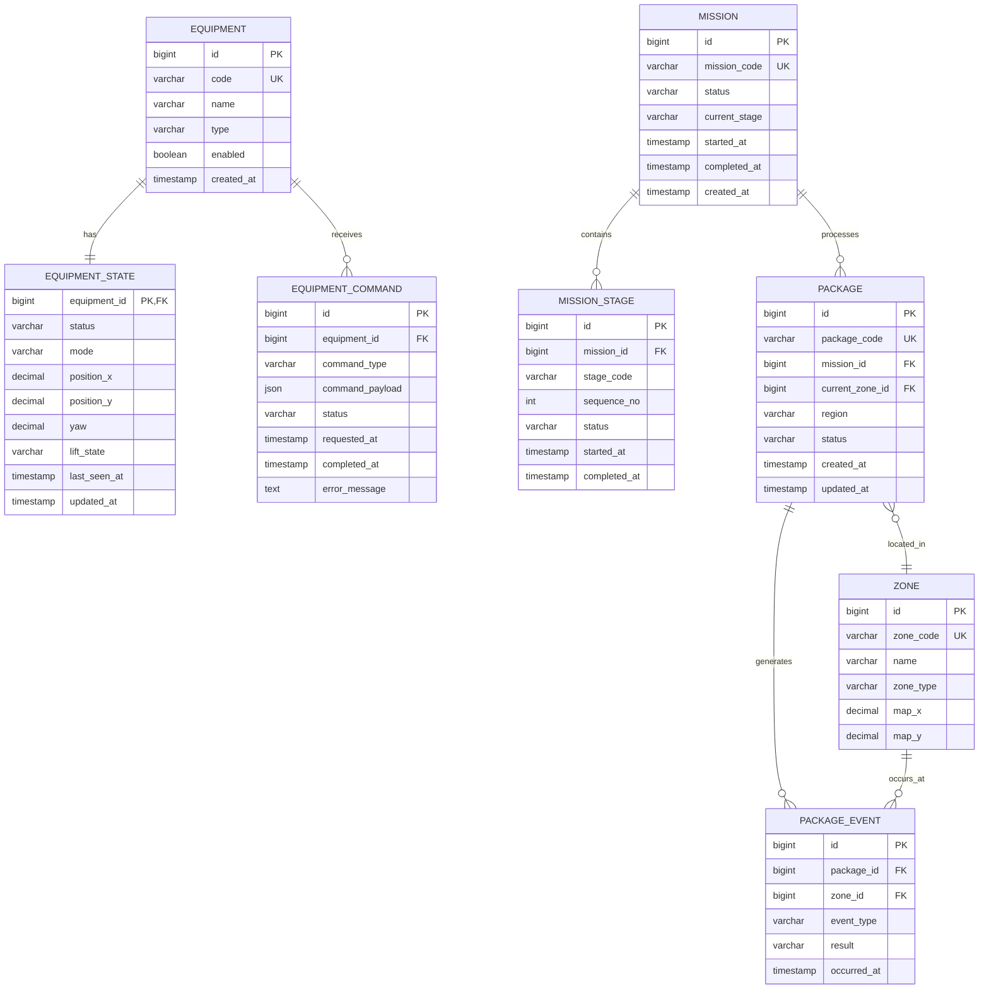

# Control Tower Dashboard 개발 기준 문서

## 0. 문서 목적

이 문서는 현재 진행 중인 **대형 물류 자동화 & 관제 제어 시스템** 프로젝트에서
Control Tower Dashboard를 개발하기 위한 기준을 정리한 문서이다.

이 문서에는 다음 내용을 포함한다.

- 현재 프로젝트 구현 상태
- 최종 물류 시나리오
- Control Tower 개발 목표
- 기능 우선순위
- 제외 또는 후순위 기능
- ERD
- 테이블별 역할
- 데이터 흐름
- Backend / Frontend / ROS2 연동 구조
- 단계별 개발 순서
- 개발환경
- 구현 완료 기준

---

# 1. 프로젝트 기준

## 프로젝트명

**대형 물류 자동화 & 관제 제어 시스템**

## GitHub

```text
https://github.com/rokey-c2/cobot3-ws-c2
```

## 현재 코드 기준점

현재 개발 기준 Commit:

```text
fd31fe0735cb278429088278d159915d89058b30
```

Commit message:

```text
feat: put new bot into the position thre previous one was on with 4 boxes
```

중요:

- 현재 원격 `euiseok-amr` HEAD를 자동으로 최신 기준으로 보지 않는다.
- 별도 지시가 없는 한 위 Commit을 코드 기준점으로 본다.
- 과거 Branch / Commit 정보가 최신 설계와 충돌할 경우 현재 기준점과 최신 확정 시나리오를 우선한다.

---

# 2. 개발환경

## 개인 개발 PC 기준

```text
OS              Ubuntu 24.04.4 LTS
CPU             Intel i7-13620H
CPU Core        10C / 16T
GPU             NVIDIA RTX 4060 Laptop
VRAM            8 GB
RAM             32 GB
NVIDIA Driver   580.173.02
CUDA            13.0
Python          3.12.3
ROS2            Jazzy
Isaac Sim       5.1.0
```

## ROS2 공통 설정

```bash
source /opt/ros/jazzy/setup.bash

export ROS_DOMAIN_ID=110
export RMW_IMPLEMENTATION=rmw_fastrtps_cpp
```

프로젝트 기준:

```text
ROS_DOMAIN_ID=110
RMW_IMPLEMENTATION=rmw_fastrtps_cpp
DDS=Fast DDS
```

### 중요 규칙

`~/.bashrc`는 앞으로 수정하지 않는다.

필요한 환경변수는:

- 터미널에서 `export`
- 프로젝트의 `scripts/`
- 실행용 shell script

등을 통해 관리한다.

---

# 3. 현재 실제 구현 상태

현재 실제 구현된 범위는 다음과 같다.

```text
[입고지]
   ↓
AMR 1대
   ↓
Package / Cargo 운송
   ↓
Manipulator 작업 위치 도착
   ↓
Manipulator Pick
   ↓
Manipulator Place
```

현재 구현 완료 범위:

- 입고지 AMR 1대
- AMR 이동
- Manipulator 작업 위치 도착
- Manipulator Pick
- Manipulator Place

중요:

현재 시스템이 이미 AMR 3대와 출고 로봇까지 완성된 상태라고 보면 안 된다.

Control Tower 설계는 **현재 실제 구현 상태 + 최종 시나리오 확장 방향**을 구분해서 진행한다.

---

# 4. 최종 물류 시나리오

Manipulator가 Package를 Place한 이후 Package는 Main Conveyor를 따라 이동한다.

분류는 한 번에 A/B/C를 선택하는 구조가 아니다.

반드시 다음과 같이 순차 분기한다.

```text
A 판별
 ↓ A가 아니면
B 판별
 ↓ B가 아니면
C 판별
 ↓ C도 아니면
Exception
```

즉 최종 분류 순서는:

```text
A → B → C → Exception
```

이다.

---

# 5. 권역별 Package Flow

## 5.1 A 권역

```text
Manipulator Place
      ↓
Main Conveyor
      ↓
Wheel Sorter A
      ↓
A 권역 확인
      ↓
DIVERT
      ↓
A Conveyor
```

A Package는 첫 번째 Wheel Sorter에서 바로 분기된다.

---

## 5.2 B 권역

```text
Manipulator Place
      ↓
Main Conveyor
      ↓
Wheel Sorter A
      ↓
A 아님 → PASS
      ↓
Wheel Sorter B
      ↓
B 권역 확인
      ↓
DIVERT
      ↓
B Conveyor
```

---

## 5.3 C 권역

```text
Manipulator Place
      ↓
Main Conveyor
      ↓
Wheel Sorter A
      ↓
A 아님 → PASS
      ↓
Wheel Sorter B
      ↓
B 아님 → PASS
      ↓
Wheel Sorter C
      ↓
C 권역 확인
      ↓
DIVERT
      ↓
C Conveyor
```

---

## 5.4 Exception

A/B/C 어느 권역에도 해당하지 않는 Package는 마지막 Conveyor로 보낸다.

```text
Manipulator Place
      ↓
Main Conveyor
      ↓
Wheel Sorter A
      ↓
PASS
      ↓
Wheel Sorter B
      ↓
PASS
      ↓
Wheel Sorter C
      ↓
PASS
      ↓
Exception Conveyor
```

Exception 대상 예시:

- 권역 정보 없음
- A/B/C에 해당하지 않음
- 잘못된 분류 정보
- 추후 정의할 비정상 Package

---

# 6. 최종 End-to-End Flow

```text
START
  ↓
입고지 AMR 대기
  ↓
AMR이 Package / Cargo Pickup
  ↓
Manipulator 작업 위치 이동
  ↓
Manipulator Station 도착
  ↓
Manipulator Pick
  ↓
Manipulator Place
  ↓
Package Main Conveyor 진입
  ↓
[A 분기점]
  ├─ A → A Conveyor
  └─ A 아님
       ↓
     [B 분기점]
       ├─ B → B Conveyor
       └─ B 아님
            ↓
          [C 분기점]
            ├─ C → C Conveyor
            └─ C 아님
                 ↓
          Exception Conveyor
  ↓
분류 완료
  ↓
END
```

---

# 7. Control Tower 개발 목표

Control Tower는 단순 Monitoring Dashboard가 아니라 다음 역할을 해야 한다.

```text
상태 확인
   ↓
Mission 진행 확인
   ↓
Package 흐름 추적
   ↓
장비 제어
```

최종적으로:

```text
Isaac Sim
    ↓
ROS2
    ↓
Backend
    ↓
Database
    ↓
WebSocket
    ↓
React Dashboard
```

구조를 실제로 연결하는 것을 목표로 한다.

포트폴리오에서 강조할 핵심은:

- Robotics Integration
- ROS2 Integration
- Backend
- Database
- Real-time WebSocket
- Frontend Dashboard
- System Integration

이다.

---

# 8. 확정된 Control Tower 기능

현재 개발 범위는 다음 6개 기능으로 확정한다.

| 기능 | Priority | 난이도 | 포트폴리오 가치 | 결정 |
|---|---|---:|---:|---|
| 기계 위치 및 상태 | P0 | 중 | ★★★★★ | 반드시 |
| 전체 / 개별 Start & Stop | P0 | 중 | ★★★★★ | 반드시 |
| 진행 상황 / Mission 단계 | P0 | 중 | ★★★★★ | 반드시 |
| 박스 실시간 상태 / 위치 추적 | P0 | 중~상 | ★★★★★ | 반드시 |
| 특정 위치까지 AMR 보내기 | P1 | 중 | ★★★★★ | 강력 추천 |
| AMR Lift Up / Down | P1 | 낮~중 | ★★★★☆ | 구현 |

---

# 9. 이번 버전에서 제외한 기능

다음 기능은 현재 v1 범위에서 제외한다.

## Manual Mode

후순위.

## 자유로운 AMR 수동 이동

현재 Control Tower 핵심이 아니므로 제외.

## Top View Camera / AMR Camera

실시간 스트리밍 구현 공수가 크기 때문에 현재 범위에서 제외.

## 기타 제외

- 과도한 Analytics
- 의미 없는 Pie / Donut Chart
- 로그인 / 회원가입
- AI 예측
- 날씨
- 배터리 데이터가 실제로 없는데 임의 표시
- 정밀 Package XY Tracking

---

# 10. 기계 위치 및 상태

Control Tower에서 최소한 다음 장비 상태를 표시한다.

```text
AMR
P3020
MAIN_CONVEYOR
SORTER_A
SORTER_B
SORTER_C
```

AMR 예시:

```text
AMR_IN

Status      NAVIGATING
Position    x=3.12
            y=-1.84
Yaw         1.57
Lift        UP
Mission     M-0017
```

P3020 예시:

```text
P3020_IN

Status
PICKING
```

Conveyor:

```text
MAIN_CONVEYOR

Status
RUNNING
```

Sorter:

```text
SORTER_A

Status
READY
```

---

# 11. 전체 / 개별 Start & Stop

Control Tower에서 다음 두 종류의 제어를 지원한다.

## 전체 시스템

```text
SYSTEM START
SYSTEM STOP
```

## 개별 Equipment

```text
AMR_IN
[START] [STOP]

P3020_IN
[START] [STOP]

MAIN_CONVEYOR
[START] [STOP]

SORTER_A
[START] [STOP]

SORTER_B
[START] [STOP]

SORTER_C
[START] [STOP]
```

주의:

현재 v1에서는 E-STOP을 일반 STOP과 억지로 합치지 않는다.

E-STOP은 추후 별도 Safety 기능으로 분리 가능하다.

---

# 12. Mission 진행 상황

Dashboard에서 현재 Mission이 어디까지 진행되었는지 표시한다.

예:

```text
MISSION M-0017

✓ AMR PICKUP
✓ AMR NAVIGATION
✓ MANIPULATOR PICK
✓ MANIPULATOR PLACE
● MAIN CONVEYOR
○ SORTER A
○ SORTER B
○ SORTER C
○ COMPLETE
```

B Package 예시:

```text
✓ AMR PICKUP
✓ AMR NAVIGATION
✓ MANIPULATOR PICK
✓ MANIPULATOR PLACE
✓ MAIN CONVEYOR
✓ SORTER A - PASS
● SORTER B - DIVERT
○ REGION B
```

---

# 13. Package Tracking 방식

정밀 실시간 XY Tracking은 현재 범위에서 하지 않는다.

대신 **Zone 기반 Tracking**을 사용한다.

Zone:

```text
INPUT_ZONE
AMR_IN
P3020_IN
MAIN_CONVEYOR
SORTER_A
SORTER_B
SORTER_C
REGION_A
REGION_B
REGION_C
EXCEPTION
```

예:

```text
PKG-0017

Region:
B

Current Zone:
SORTER_A

Status:
PASSING
```

다음 단계:

```text
Current Zone:
SORTER_B

Status:
DIVERTING
```

이 방식의 장점:

- 구현 난이도 감소
- 실제 운영 상태 이해 쉬움
- DB 구조 단순
- Event Log 생성 쉬움
- 포트폴리오 설명 쉬움

---

# 14. 특정 위치까지 AMR 보내기

Control Tower에서 AMR 목적지를 지정할 수 있도록 한다.

예:

```text
AMR_IN

Current
x = 10.5
y = -1.5

Target
x = 1.3
y = -0.06
yaw = 0.0

[SEND GOAL]
```

데이터 흐름:

```text
React
  ↓
FastAPI
  ↓
ROS2 Adapter
  ↓
Nav2 Goal
  ↓
Isaac Sim AMR
```

이 기능은 Dashboard → ROS2 → Robot의 역방향 제어를 증명한다.

---

# 15. AMR Lift Up / Down

AMR 상세 UI에서 다음 버튼을 제공한다.

```text
[LIFT UP]
[LIFT DOWN]
```

상태 예시:

```text
DOWN
LIFTING
UP
LOWERING
FAILED
```

데이터 흐름:

```text
Dashboard
   ↓
FastAPI
   ↓
ROS2
   ↓
Lift Command
   ↓
Isaac Sim
```

---

# 16. Control Tower v1 ERD

현재 DB는 8개 Table로 구성한다.

```text
1. equipment
2. equipment_state
3. equipment_command
4. mission
5. mission_stage
6. package
7. zone
8. package_event
```

ERD:



---

# 17. equipment Table

기계 자체의 기본 정보를 관리한다.

예:

| code | name | type |
|---|---|---|
| AMR_IN | Inbound AMR | AMR |
| P3020_IN | Inbound Manipulator | MANIPULATOR |
| MAIN_CONVEYOR | Main Conveyor | CONVEYOR |
| SORTER_A | Region A Sorter | SORTER |
| SORTER_B | Region B Sorter | SORTER |
| SORTER_C | Region C Sorter | SORTER |

변하지 않는 기본 정보를 저장한다.

---

# 18. equipment_state Table

각 기계의 **현재 상태**를 저장한다.

AMR 예:

```text
equipment_id = AMR_IN
status       = NAVIGATING
position_x   = 3.12
position_y   = -1.84
yaw          = 1.57
lift_state   = UP
last_seen_at = ...
```

P3020:

```text
status = PICKING
```

Conveyor:

```text
status = RUNNING
```

Sorter:

```text
status = READY
```

중요:

`/odom` 데이터가 들어올 때마다 새 row를 INSERT하지 않는다.

현재 상태는 `UPDATE`한다.

즉:

```text
equipment_state
= Current Snapshot
```

역할이다.

---

# 19. equipment_command Table

Dashboard에서 Robot 또는 Equipment로 보낸 명령 기록을 저장한다.

지원 명령:

```text
START
STOP
NAVIGATE
LIFT_UP
LIFT_DOWN
```

AMR Navigate 예시:

```json
{
  "x": 1.3,
  "y": -0.06,
  "yaw": 0.0
}
```

Command 상태:

```text
PENDING
EXECUTING
SUCCESS
FAILED
```

이 Table을 통해 어떤 명령이 성공 또는 실패했는지 추적한다.

---

# 20. mission Table

하나의 물류 Mission을 관리한다.

예:

```text
mission_code = M-20260825-001
status = RUNNING
current_stage = MAIN_CONVEYOR
```

Mission Status:

```text
READY
RUNNING
PAUSED
COMPLETE
ERROR
```

---

# 21. mission_stage Table

Mission 세부 단계를 저장한다.

예:

| sequence | stage | status |
|---:|---|---|
| 1 | AMR_PICKUP | COMPLETE |
| 2 | AMR_NAVIGATION | COMPLETE |
| 3 | MANIPULATOR_PICK | COMPLETE |
| 4 | MANIPULATOR_PLACE | COMPLETE |
| 5 | MAIN_CONVEYOR | RUNNING |
| 6 | SORTER_A | WAITING |
| 7 | SORTER_B | WAITING |
| 8 | SORTER_C | WAITING |
| 9 | COMPLETE | WAITING |

Dashboard Progress UI를 만들 때 사용한다.

---

# 22. package Table

Package의 현재 상태를 저장한다.

예:

```text
package_code = PKG-0017
region = B
current_zone = SORTER_A
status = MOVING
```

Region:

```text
A
B
C
EXCEPTION
UNKNOWN
```

---

# 23. zone Table

Package가 위치할 수 있는 논리적인 공정 위치를 저장한다.

예:

```text
INPUT_ZONE
AMR_IN
P3020_IN
MAIN_CONVEYOR
SORTER_A
SORTER_B
SORTER_C
REGION_A
REGION_B
REGION_C
EXCEPTION
```

추가로 Dashboard Map 표시를 위한:

```text
map_x
map_y
```

를 저장할 수 있다.

주의:

`zone.map_x / map_y`

는 Dashboard 상의 Zone 표시 위치이다.

`equipment_state.position_x / position_y`

는 Isaac Sim / ROS2의 실제 Robot 좌표이다.

---

# 24. package_event Table

Package의 이동 / 분류 이력을 저장한다.

B Package 예:

```text
MAIN_CONVEYOR
      ↓
SORTER_A → PASS
      ↓
SORTER_B → DIVERT
      ↓
REGION_B
```

예시 Event:

| Time | Zone | Event | Result |
|---|---|---|---|
| 15:20:10 | MAIN_CONVEYOR | ENTER | SUCCESS |
| 15:20:14 | SORTER_A | SORT | PASS |
| 15:20:18 | SORTER_B | SORT | DIVERT |
| 15:20:22 | REGION_B | ARRIVE | SUCCESS |

이 Table은 Event Timeline에도 사용할 수 있다.

---

# 25. 전체 시스템 데이터 흐름

## Robot → Dashboard

```text
Isaac Sim
    ↓
ROS2 Bridge
    ↓
ROS2 Topics / Actions
    ↓
ROS2 Adapter
    ↓
FastAPI
    ↓
Database
    ↓
WebSocket
    ↓
React Control Tower
```

---

## Dashboard → Robot

```text
React Control Tower
      ↓
FastAPI
      ↓
equipment_command
      ↓
ROS2 Adapter
      ↓
ROS2 Action / Topic
      ↓
Isaac Sim
```

지원 제어:

```text
START
STOP
NAVIGATE
LIFT_UP
LIFT_DOWN
```

---

# 26. Backend API 초안

최소 REST API:

```text
GET  /api/equipment
GET  /api/missions/current
GET  /api/packages
GET  /api/packages/{id}
GET  /api/events

POST /api/equipment/{id}/start
POST /api/equipment/{id}/stop
POST /api/amr/{id}/navigate
POST /api/amr/{id}/lift
```

WebSocket:

```text
/ws/control-tower
```

초기에는 WebSocket을 여러 개 만들지 않고 하나로 통합한다.

예시:

```json
{
  "type": "equipment_state",
  "equipment_id": "AMR_IN",
  "status": "NAVIGATING",
  "x": 3.1,
  "y": -1.2,
  "lift": "UP"
}
```

---

# 27. Frontend 기본 화면

Control Tower Overview는 다음 영역으로 구성하는 것을 기준으로 한다.

```text
┌──────────────────────────────────────────────┐
│ CONTROL TOWER                               │
│ SYSTEM STATUS             START / STOP      │
├─────────────────────────┬────────────────────┤
│                         │ CURRENT MISSION    │
│     WAREHOUSE MAP       │                    │
│                         │ Mission Progress   │
│ AMR 위치                │                    │
│ P3020                   ├────────────────────┤
│ Conveyor                │ EQUIPMENT STATUS   │
│ Sorter A/B/C            │                    │
│ Package Zone            │ AMR / P3020 / ... │
├─────────────────────────┼────────────────────┤
│ PACKAGE STATUS          │ EVENT LOG          │
└─────────────────────────┴────────────────────┘
```

---

# 28. 단계별 개발 순서

## STEP 1. DB Schema 구현

목표:

8개 Table 실제 PostgreSQL 생성.

```text
equipment
equipment_state
equipment_command
mission
mission_stage
package
zone
package_event
```

해야 할 일:

- PostgreSQL 준비
- Schema 작성
- Table 생성
- Foreign Key 확인
- Sample Data Insert
- SELECT 확인

완료 기준:

```text
AMR_IN
P3020_IN
MAIN_CONVEYOR
SORTER_A
SORTER_B
SORTER_C
```

가 DB에서 정상 조회된다.

---

# 29. STEP 2. FastAPI Backend 뼈대

목표:

ROS2 연결 전에 REST API를 먼저 완성.

해야 할 일:

- DB 연결
- Model
- Schema
- Repository / Service
- Router
- Swagger 테스트

최소 API:

```text
GET /api/equipment
GET /api/missions/current
GET /api/packages
GET /api/events
```

Control API:

```text
POST /api/equipment/{id}/start
POST /api/equipment/{id}/stop
POST /api/amr/{id}/navigate
POST /api/amr/{id}/lift
```

완료 기준:

FastAPI:

```text
/docs
```

에서 모든 API를 호출할 수 있다.

---

# 30. STEP 3. React Mock Dashboard

목표:

ROS2보다 먼저 Dashboard UI를 완성한다.

Mock JSON으로:

- Equipment Status
- Mission
- Package
- Event
- Map

를 표시한다.

중요:

이 단계에서는 ROS2 연결을 하지 않는다.

이유:

Backend / ROS2 / UI를 동시에 만들면 문제 발생 위치를 찾기 어렵다.

완료 기준:

실제 데이터가 없어도 포트폴리오 수준의 Control Tower 화면이 보인다.

---

# 31. STEP 4. WebSocket

FastAPI에:

```text
/ws/control-tower
```

를 추가한다.

목표:

Backend 상태 변화가 Frontend에 실시간 반영.

예:

```text
AMR 이동
→ position 변경
→ WebSocket
→ Map AMR 아이콘 이동
```

---

# 32. STEP 5. ROS2 Adapter

여기서 실제 Robotics System과 연결한다.

구조:

```text
Isaac Sim
    ↓
ROS2
    ↓
ROS2 Adapter
    ↓
FastAPI / DB / WebSocket
```

가장 먼저 AMR 위치부터 연결한다.

예:

```text
/odom
```

또는 현재 AMR의 실제 Odometry Topic을 Subscribe.

수집 값:

```text
x
y
yaw
```

DB:

```text
equipment_state
```

UPDATE.

WebSocket으로 Frontend에 전달.

완료 기준:

Isaac Sim에서 AMR이 움직이면 Dashboard Map에서도 AMR 위치가 움직인다.

---

# 33. STEP 6. Equipment Status 연결

장비별 상태를 Dashboard에 실제 연결한다.

## AMR

```text
NAVIGATING
IDLE
STOPPED
ERROR

position_x
position_y
yaw

lift_state
```

## P3020

```text
IDLE
PICKING
PLACING
ERROR
```

## Conveyor

```text
RUNNING
STOPPED
ERROR
```

## Sorter

```text
READY
RUNNING
STOPPED
ERROR
```

---

# 34. STEP 7. Mission Stage 연결

최종 Mission Stage:

```text
AMR_PICKUP
AMR_NAVIGATION
MANIPULATOR_PICK
MANIPULATOR_PLACE
MAIN_CONVEYOR
SORTER_A
SORTER_B
SORTER_C
COMPLETE
```

Exception이면:

```text
SORTER_A PASS
SORTER_B PASS
SORTER_C PASS
EXCEPTION
```

Dashboard Progress와 DB `mission_stage`를 같이 갱신한다.

---

# 35. STEP 8. Package Zone Tracking

Package는 실시간 정밀 좌표 대신 Zone Tracking.

예:

```text
PKG-0017

MAIN_CONVEYOR
      ↓
SORTER_A
      ↓
SORTER_B
      ↓
REGION_B
```

현재 위치:

```text
package.current_zone_id
```

과거 History:

```text
package_event
```

로 관리한다.

---

# 36. STEP 9. Start / Stop

Dashboard 버튼:

```text
SYSTEM START
SYSTEM STOP
```

개별:

```text
AMR START / STOP
P3020 START / STOP
CONVEYOR START / STOP
SORTER START / STOP
```

흐름:

```text
Dashboard
    ↓
FastAPI
    ↓
equipment_command
    ↓
ROS2 Adapter
    ↓
Robot / Equipment
```

중요:

UI 상태만 바뀌는 Fake Control은 만들지 않는다.

---

# 37. STEP 10. AMR Navigate

Dashboard에서:

```text
x
y
yaw
```

입력.

예:

```text
x = 1.3
y = -0.06
yaw = 0.0
```

흐름:

```text
Dashboard
 ↓
FastAPI
 ↓
ROS2 Adapter
 ↓
Nav2 Action
 ↓
AMR
```

완료 기준:

Dashboard에서 Goal 전송 후 Isaac Sim의 AMR이 실제 이동한다.

---

# 38. STEP 11. Lift Up / Down

버튼:

```text
LIFT UP
LIFT DOWN
```

실제 ROS2 Lift Command와 연결.

완료 기준:

Dashboard에서 명령 → Isaac Sim AMR Lift 실제 동작.

---

# 39. STEP 12. 최종 통합 테스트

대표 Scenario는 B Package를 추천한다.

이유:

A 분기 PASS와 B DIVERT를 모두 확인할 수 있기 때문이다.

최종 테스트:

```text
AMR 출발
 ↓
Manipulator 도착
 ↓
Pick
 ↓
Place
 ↓
Main Conveyor
 ↓
Sorter A
 ↓ PASS
Sorter B
 ↓ DIVERT
Region B
```

Dashboard에서는 동시에:

```text
AMR 위치 이동
Equipment 상태 변경
Mission 단계 변경
Package Zone 변경
Package Event 생성
```

이 모두 실시간으로 보여야 한다.

---

# 40. 이틀 개발 기준

## Day 1

목표:

Control Tower Software Layer 완성.

```text
DB
FastAPI
React Mock
WebSocket
```

완료 목표:

- ERD 실제 구현
- API
- Mock Dashboard
- WebSocket

---

## Day 2

목표:

Robotics Integration.

```text
AMR 위치
Equipment Status
Mission Stage
Package Tracking
Start / Stop
Navigate
Lift
```

중요:

Camera / Manual Teleoperation은 이번 범위에서 제외한다.

---

# 41. 개발 우선순위

최종 구현 순서:

```text
1. DB
2. FastAPI
3. React Mock
4. WebSocket
5. AMR 위치
6. Equipment 상태
7. Mission Progress
8. Package Zone
9. Start / Stop
10. Navigate
11. Lift
12. Integration Test
```

이 순서를 임의로 뒤집지 않는 것을 권장한다.

특히 처음부터:

```text
AMR
P3020
Sorter
Database
Frontend
```

를 전부 동시에 연결하지 않는다.

첫 번째 실제 통합 성공 기준은:

```text
Isaac Sim AMR 이동
      ↓
ROS2 /odom
      ↓
Backend
      ↓
WebSocket
      ↓
Dashboard AMR 이동
```

이다.

---

# 42. 포트폴리오에서 보여줄 핵심

가장 중요한 3가지:

## 1. Equipment 실시간 관제

```text
AMR / P3020 / Conveyor / Sorter
```

의 상태가 실제로 연결되어 있음.

## 2. Mission / Package Tracking

Package 하나가:

```text
AMR
→ Manipulator
→ Main Conveyor
→ Sorter A
→ Sorter B
→ Region B
```

를 이동하는 과정을 Dashboard에서 추적.

## 3. Dashboard → ROS2 제어

```text
Start
Stop
Navigate
Lift
```

명령이 실제 Simulation에 전달.

이 세 가지가 성공하면 프로젝트는 단순 웹 Dashboard가 아니라:

**ROS2 기반 물류 자동화 Control Tower**

로 설명할 수 있다.

---

# 43. 최종 한 줄 정의

```text
AMR, Manipulator, Conveyor, Wheel Sorter로 구성된 물류 자동화 시스템의
장비 상태, Mission 진행, Package 흐름을 실시간 관제하고,
Dashboard에서 Start/Stop, Navigation, Lift 명령까지 수행하는
ROS2 기반 Warehouse Control Tower
```

---

# 44. 현재 확정 상태 요약

```text
[구현 완료]
입고 AMR 1대
→ Manipulator Pick & Place

[최종 시나리오]
Manipulator Place
→ Main Conveyor
→ Sorter A
→ Sorter B
→ Sorter C
→ Exception

[Control Tower v1]
Equipment 위치/상태
System/Equipment Start Stop
Mission Progress
Package Zone Tracking
AMR Navigate
AMR Lift Up/Down

[DB]
8 Tables

[개발 순서]
DB
→ FastAPI
→ React Mock
→ WebSocket
→ ROS2 Adapter
→ 실데이터
→ Control
→ Integration Test
```
